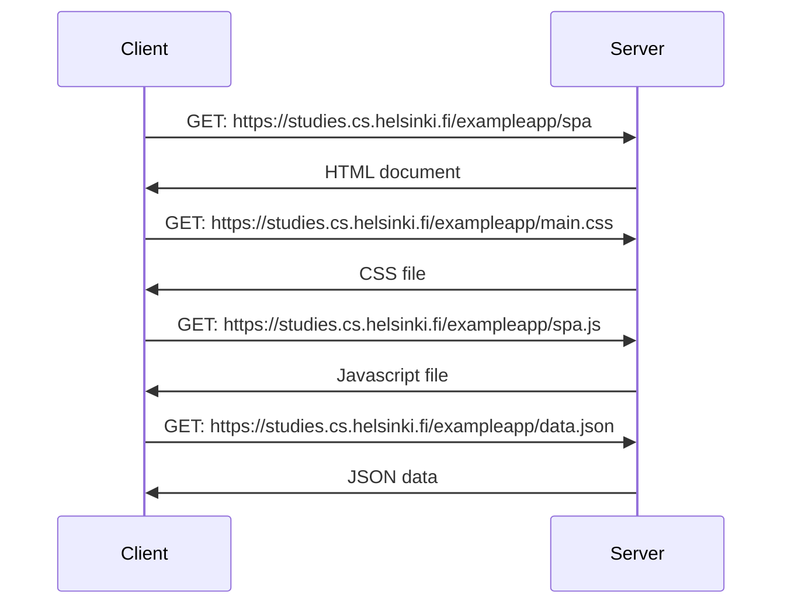

```mermaid
sequenceDiagram
    participant Client
    participant Server
    Client->>Server: GET: https://studies.cs.helsinki.fi/exampleapp/spa
    Server->>Client: HTML document
    Client->>Server: GET: https://studies.cs.helsinki.fi/exampleapp/main.css
    Server->>Client: CSS file
    Client->>Server: GET: https://studies.cs.helsinki.fi/exampleapp/spa.js
    Server->>Client: Javascript file
    Client->>Server: GET: https://studies.cs.helsinki.fi/exampleapp/data.json
    Server->>Client: JSON data
```